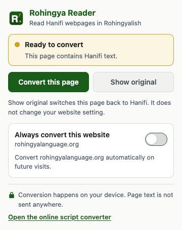

# Rohingya Tools — Hanifi Script Converter & Rohingya Reader

[](https://github.com/abahziz0/rohingya-tools/actions/workflows/check.yml)
[](LICENSE)

Open-source **Hanifi Rohingya ↔ Rohingyalish script conversion** and the
**Rohingya Reader Chrome extension**, maintained by
[RohingyaLanguage.org](https://rohingyalanguage.org/).

Convert Rohingya text between the Hanifi Unicode script and the Latin-based
Rohingyalish writing system, or read Hanifi text on webpages in Rohingyalish.
The TypeScript converter runs offline and can be used in browser applications
or Node.js. Script conversion changes the writing system; it does not translate
Rohingya into English or another language.

**[Try the online script converter](https://rohingyalanguage.org/tools/script-converter/)**
· **[Install Rohingya Reader from the Chrome Web Store](https://chromewebstore.google.com/detail/ojdnhefanlhaamffnpemofgligjbfngg)**
· **[Visit RohingyaLanguage.org](https://rohingyalanguage.org/)**

## Watch Rohingya Reader

A 20-second introduction to the Chrome extension.

[](https://rohingyalanguage-rohingya-script-converter.static.hf.space/index.html#video)

[Watch the video in the Hugging Face Space](https://huggingface.co/spaces/rohingyalanguage/rohingya-script-converter) ·
[Download the original MP4](https://huggingface.co/spaces/rohingyalanguage/rohingya-script-converter/resolve/main/rohingya-reader-demo.mp4)

Questions or feedback: [ab@rohingyalanguage.org](mailto:ab@rohingyalanguage.org).

## What is included

| Tool | Purpose | Source |
| --- | --- | --- |
| Rohingya script converter | Hanifi to Rohingyalish and Rohingyalish to Hanifi transliteration, including digits and supported combining marks | [`converter/`](converter/) |
| Rohingya Reader | Chrome Manifest V3 extension: convert page text, restore originals, and optionally remember websites | [`extension/`](extension/) |

The extension and library use the same rule-based conversion engine. The
repository builds independently and contains the tool source, examples, tests,
and required assets.

## Quick start

Use **Node.js 24.15 or newer**. Run these commands from the repository root:

```sh
git clone https://github.com/abahziz0/rohingya-tools.git
cd rohingya-tools
npm ci
npm run build
```

The library builds to `converter/dist/`. The unpacked Chrome extension builds
to `extension/dist/`.

To install your local build, open `chrome://extensions`, enable **Developer
mode**, choose **Load unpacked**, and select `extension/dist`. Open a webpage
containing Hanifi Rohingya text and choose **Convert this page** in the popup.

## Use the converter in JavaScript or TypeScript

After building, the library exports `latinToHanifi` and `hanifiToLatin`:

```js
import { latinToHanifi, hanifiToLatin } from './converter/dist/index.js';

const hanifi = latinToHanifi('kitab');
console.log(hanifi.output); // 𐴑𐴞𐴃𐴝𐴁
console.log(hanifi.warnings); // []

const latin = hanifiToLatin(hanifi.output);
console.log(latin.output); // kitab
```

Each function returns `{ output, warnings }`. See the
[converter documentation](converter/README.md) for Unicode handling and
conversion limits. The converter package is available as source in this
repository; no npm registry installation is required.

## Rohingya Reader features



- Convert Hanifi Rohingya webpage text to Rohingyalish on your device.
- Restore the original text with **Show original**.
- Convert newly loaded text in feeds and comments.
- Enable automatic conversion for individual websites, with permission.
- Preserve links, page structure, form fields, and editable content.
- Read conversion warnings in the popup.

The extension has no account, analytics, backend, or remote conversion service.
It uses bundled code and fonts. See its
[privacy information](extension/docs/privacy-policy.md) and
[technical documentation](extension/README.md).

## Check and test

```sh
npm run check
npx playwright install chromium
npm run test:e2e
```

`check` builds the converter, checks TypeScript, runs unit tests, packages the
extension, and verifies the ZIP. Browser tests load the actual extension in
Chromium against local test pages. The test manifest grants access to localhost
only; release ZIPs use the release manifest.

For demonstration pages, run `npm run fixtures:serve` and visit
`http://127.0.0.1:4173/`. To create an installable ZIP, run `npm run package`;
it is written to `extension/release/`.

## Accuracy and browser support

The converter is **beta and approximate**. Automated tests establish technical
behavior and consistency; they do not establish linguistic accuracy. Current
examples are engine snapshots awaiting fluent-reader review. Some distinctions
between Hanifi and Rohingyalish are lost during conversion.

Chrome is the intended browser. Browser tests use Chromium. Other Chromium
browsers and Firefox have not been verified. The extension does not process
iframes, shadow DOM, text in images, scanned documents, or legacy font encodings.
See [known limitations](extension/docs/limitations.md).

## Contribute

Bug reports, reproducible conversion examples, accessibility improvements, and
linguistic review are welcome. Read [CONTRIBUTING.md](CONTRIBUTING.md) before
opening an issue or pull request. Report security concerns through the
[security policy](SECURITY.md).

## Contact

For questions, feedback, and collaboration, email [ab@rohingyalanguage.org](mailto:ab@rohingyalanguage.org).

## Project and license

Created and maintained by [RohingyaLanguage.org](https://rohingyalanguage.org/).
Find the [online Rohingya script converter](https://rohingyalanguage.org/tools/script-converter/)
and [Hanifi Rohingya Unicode reference](https://rohingyalanguage.org/resources/hanifi-rohingya-unicode/)
on the website.

Code and documentation: [MIT](LICENSE).
Noto Sans Hanifi Rohingya fonts: [SIL Open Font License 1.1](extension/assets/fonts/OFL.txt).
See [third-party notices](NOTICE.md).
